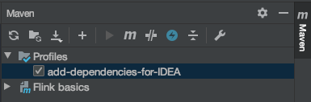

# Flink basics

Project with same basic examples of the Flink Java API.

## How to execute this project
The recommended IDE for executing this project is IntelliJ.

In order to execute this project correctly in IntelliJ, the following option must be selected:

With this, the IDE will have into account the dependencies included in the maven profile with id `add-dependencies-for-IDEA`,
included in the pom.xml.

## Useful documentation sources
### Windows
* [Introducing Stream Windows in Apache Flink (blog post)](https://flink.apache.org/news/2015/12/04/Introducing-windows.html)
* [Windows (official documentation)](https://ci.apache.org/projects/flink/flink-docs-stable/dev/stream/operators/windows.html)

> __ReduceFunction and AggregateFunction can be executed more efficiently__ (see State Size section)
> because Flink can incrementally aggregate the elements for each window as they arrive.  
> A ProcessWindowFunction gets an Iterable for all the elements contained in a window 
> and additional meta information about the window to which the elements belong.  
> Therefore, a windowed transformation with a __ProcessWindowFunction cannot be executed as efficiently
> as the other cases__ because Flink has to buffer all elements for a window internally before invoking the function.
> 
> https://ci.apache.org/projects/flink/flink-docs-stable/dev/stream/operators/windows.html#window-functions

> WindowFunction is an older version of ProcessWindowFunction that provides less contextual information and
> does not have some advances features, such as per-window keyed state. This interface will be deprecated at some point.
>
> https://ci.apache.org/projects/flink/flink-docs-stable/dev/stream/operators/windows.html#windowfunction-legacy